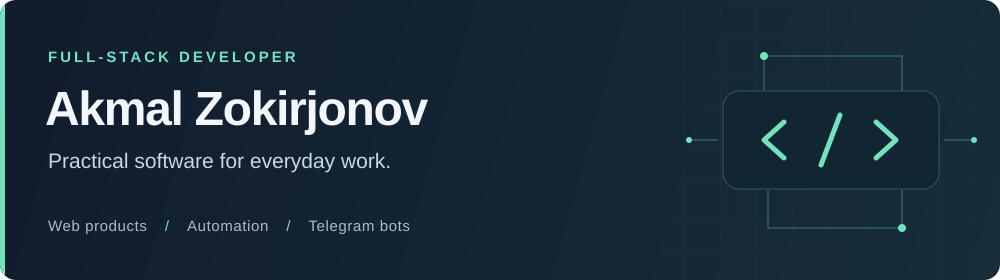

I build web applications, workflow automation tools, and Telegram bots. My focus is on clear user experiences and maintainable backend systems.

Based in **Tashkent, Uzbekistan** · Working with **[@fizmasoft](https://github.com/fizmasoft)**

[Explore my projects](#selected-projects) · [Technology stack](#technology-stack) · [Current focus](#current-focus)

## Selected projects

### [PravaBor](https://www.pravabor.uz)

A driving theory practice platform for Uzbekistan, with timed exams, topic-based practice, mistake review, and progress tracking. Available in Uzbek Latin, Uzbek Cyrillic, and Russian.

`Next.js` `React` `TypeScript` `Firebase` `Tailwind CSS`

[Live platform →](https://www.pravabor.uz) · [Project showcase](https://github.com/akmalzokirjonov/pravabor-showcase) · Application source is private.

### [All Saver Bot](https://github.com/akmalzokirjonov/all-saver-bot)

A Telegram media downloader with English, Uzbek, and Russian interfaces. Includes download quality selection, retries, rate limiting, and Docker deployment.

`Python` `aiogram` `yt-dlp` `Redis` `Docker`

[View source & setup guide →](https://github.com/akmalzokirjonov/all-saver-bot#readme)

### [AI Administrator](https://github.com/akmalzokirjonov/ai-administrator)

An Uzbek-language landing page for an AI-assisted Telegram sales administrator. Presents the product through a customer conversation comparison, responsive layouts, and clear calls to action.

`HTML` `Tailwind CSS` `JavaScript` `GitHub Pages`

[Live demo →](https://akmalzokirjonov.github.io/ai-administrator/) · [View source](https://github.com/akmalzokirjonov/ai-administrator)

## Technology stack

| Area | Technologies |
| :--- | :--- |
| Frontend | TypeScript, React, Next.js, HTML, CSS |
| Backend | Node.js, NestJS, Python |
| Data & deployment | PostgreSQL, Redis, Docker |
| Telegram & automation | aiogram, yt-dlp |

## Current focus

- Building maintainable full-stack applications.
- Automating repetitive business workflows.
- Creating useful AI-assisted products for Uzbek-speaking users.

---

**Open to collaboration** on web applications, automation, and Telegram products. [Get in touch on Telegram →](https://t.me/zokirroff)
